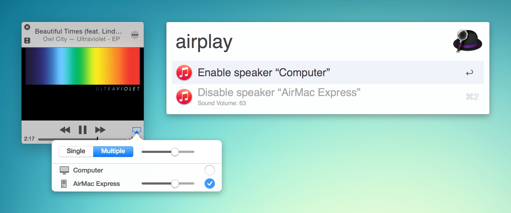

# iTunes AirPlay Control for Alfred

This is an [Alfred 2](http://www.alfredapp.com/) workflow that allows you to control iTunes AirPlay speakers via Alfred.

Note that Alfred's _workflow_ is a feature of [Powerpack](http://www.alfredapp.com/powerpack/), which is an optional paid extension.

## Installation

Download [this workflow file](https://github.com/yujinakayama/alfred-itunes-airplay/releases/download/v0.0.3/iTunes.AirPlay.Control.alfredworkflow) and simply double-click it in Finder.

## Usage

The default invocation keyword is `airplay`.

## Contributing

1. Fork it
2. Create your feature branch (`git checkout -b my-new-feature`)
3. Commit your changes (`git commit -am 'Add some feature'`)
4. Push to the branch (`git push origin my-new-feature`)
5. Create new Pull Request
